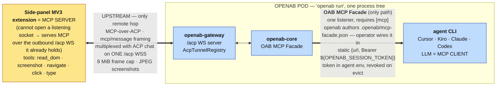

# ADR: Reverse MCP-over-ACP over WebSocket

- **Status:** Accepted — the mechanism and the generic multi-server generalization (§6) are both
  **as-built in #1447** (F1′, F3′, F4 and F5 landed; F6 e2e coverage remains).
- **Date:** 2026-07-18 (updated 2026-07-24)
- **Author:** @brettchien
- **Related:** [ACP Server over WebSocket — Base (as-built)](./acp-server-websocket-base.md),
  [ACP Server with WebSocket Transport](./acp-server-websocket.md) (original proposal),
  [openab-agent MCP](./openab-agent-mcp.md).
  The browser extension's implementation contract:
  [MCP-over-ACP tunnel contract](../mcp-over-acp-tunnel-contract.md).

---

## 1. Context

This ADR records **reverse MCP-over-ACP**: a mechanism that lets an ACP **WebSocket client** —
one that cannot open a listening socket — nevertheless act as an **MCP server**, serving its
tools to a colocated agent over the outbound `/acp` WS it already holds. OpenAB core is the MCP
proxy/aggregator in the middle; the agent is a normal in-pod MCP client.

The first, driving consumer is **browser control**: a browser side-panel extension serves DOM
tools so the agent's LLM can autonomously operate the user's real, logged-in Chrome (see **§7** for that
concrete design and the extension contract). This ADR describes the general mechanism and its generalization to **multiple,
arbitrary** client-side MCP servers (§6), using browser control as the running example.

## 2. Decision

Expose a client-side capability as **MCP tools** and route them to the agent via **MCP-over-ACP**,
tunnelled over the **existing `/acp` WebSocket** the client already holds.

Why MCP (not a custom ACP `ExtRequest`): for the LLM to *autonomously* use a capability, its
actions must appear in the agent's tool list (`tools/list`) so the model discovers and calls them.
A custom `ExtRequest` is a transport-level ACP extension the LLM never sees as a tool — it only
fits OpenAB-driven (non-LLM) operations. MCP is the standard way agents receive tools.

### Roles
- **ACP WS client = MCP server (role/logic).** It handles `tools/list` / `tools/call` and executes
  the actions. A client that cannot open a *listening* socket (e.g. an MV3 browser extension) can
  still be an MCP server — MCP server/client is about *who provides tools*, not who opens the
  connection — so it serves MCP over the **outbound `/acp` WS it already opened**. This is the only
  way a can't-listen client can be a full MCP server.
- **OpenAB core = MCP proxy/aggregator.** A middlebox between two connections: it consumes the
  client's tools from the upstream tunnel and re-exposes them to the agent downstream. Note the LLM's
  own `tools/list` does **not** show them: it sees the facade's two meta-tools, and reaches the
  client's tools through `search_capabilities` / `execute_capability` (§6.3).
- **Agent = MCP client.** The agent (Claude / Codex / Cursor / Kiro …) is a subprocess colocated in
  the OpenAB pod; it calls the tools over its in-pod MCP link.

### One WebSocket, multiplexed
The single `/acp` WS carries BOTH the ACP chat session (initialize / session.prompt /
session.update) AND the tunnelled MCP traffic (tools/list / tools/call / results), distinguished by
ACP method namespace. No second connection. This multiplexing applies to the **upstream** hop
(client ↔ gateway), using the official MCP-over-ACP `mcp/message` framing. The **downstream** hop
(core ↔ agent) is *not* tunnelled over ACP — core hosts a normal in-process MCP server the agent
connects to; only the client, which cannot listen, needs MCP tunnelled over its `/acp` WS.

## 3. Protocol gap to close first

The base does only client→agent (prompt) and agent→client **notifications** (streaming text).
Reverse MCP needs the **agent→client REQUEST** direction (request/response: the agent asks the
client to do X and awaits a result). The WS is already bidirectional; `acp_server`'s dispatch loop
adds the agent-initiated-request path. This is also where the wire types move from hand-rolled to
**generated** (see §9).

### 3.1 Advertising the capability

`handle_initialize` advertises MCP-over-ACP support as a **reverse-DNS-namespaced `_meta` key**
under `agentCapabilities.mcpCapabilities._meta`: `"dev.openab/acp": true` — the reverse-DNS of
openab's domain (`openab.dev`) plus the capability key, following the **2026-07-28 MCP `_meta`
namespaced-key convention** (SEP-1788), whose own reserved keys look like
`io.modelcontextprotocol/logLevel`.

Two 2026-07-28 mechanisms are easy to conflate, so name them apart: this is the **`_meta`
namespaced-key convention** (a reverse-DNS key on the free-form `_meta` map), **not** the separate
**typed `extensions` map**. openab uses the former. It rides `_meta` because the vendored v1
`McpCapabilities` has only `http`, `sse` and a free-form `_meta`; adding an `extensions` field would
fork the generated wire types, which this PR deliberately avoids (F1(a)). This is alignment to the
`_meta` convention, **not** a core-field divergence — the review's original ask (a core
`mcpCapabilities.acp` field) is the pre-convention direction, and a bare `_meta.acp` key (an earlier
draft) is the informal form the reserved-key convention supersedes. The capability would move to the
typed `extensions` map if and when the vendored schema gains it.

## 4. Architecture (browser control as the example)



Only the client (extension) is remote; core, gateway and agent are one in-pod `openab run` process
tree. The downstream hop has **one** delivery path: the OAB MCP Facade. It had two others — `proxy`
(HTTP MCP, once the default) and `bridge` (stdio relay) — and both were removed on 2026-07-28.

## 5. MCP usage sequence (katashiro.click as the example)

```mermaid
sequenceDiagram
    autonumber
    participant Tab as Chrome tab<br/>(user's real, logged-in)
    participant Ext as browser ext.<br/>MCP SERVER
    participant GW as openab-gateway<br/>/acp WS
    participant Core as openab-core<br/>OAB MCP Facade
    participant LLM as agent LLM<br/>MCP client

    Note over Ext,LLM: PHASE 1 — connect & agent wiring (no tool discovery yet)
    Ext->>GW: WS GET /acp — initialize<br/>mcpServers = [ type:acp, name:"katashiro" ]
    GW-->>Ext: initialize result (agentCapabilities)
    Ext->>GW: session/new  (or session/resume on reconnect)
    GW->>GW: register per-session TunnelHandle<br/>(AcpTunnelRegistry)
    GW->>Core: spawn agent (mint facade session token)
    Core->>Core: author .openab/mcp-facade.json (the ONE file openab owns)<br/>{url, Authorization: Bearer ${OPENAB_SESSION_TOKEN}}<br/>operator puts the entry in front of their agent
    LLM->>Core: MCP initialize + tools/list
    Core-->>LLM: the facade's TWO meta-tools ONLY<br/>(search_capabilities · execute_capability) — returns at once,<br/>no upstream call; katashiro.* are NOT in the model's tool list

    Note over Tab,LLM: PHASE 2 — discovery is PULL-triggered by the model
    LLM->>Core: search_capabilities("browser")
    Core->>GW: tools/list  (MCP-over-ACP: mcp/message frame)<br/>spawned on first pull per (channel_id, declared_name), then cached
    GW->>Ext: mcp/message → tools/list
    Ext-->>GW: 5 tools: read_dom · screenshot · navigate · click · type
    GW-->>Core: tools result
    Core-->>LLM: capabilities: openab-browser:katashiro.*

    Note over Tab,LLM: PHASE 3 — one autonomous action (e.g. click)
    LLM->>Core: execute_capability("openab-browser:katashiro.click", {selector})
    Core->>GW: tools/call  (mcp/message over the SAME /acp WS)
    GW->>Ext: mcp/message → tools/call
    Ext->>Tab: chrome.scripting / tabs API<br/>click · type · read_dom · captureVisibleTab · navigate
    Tab-->>Ext: DOM mutated / navigated / pixels
    Ext-->>GW: tool result<br/>(screenshot = JPEG q70, frame <= 8 MiB)
    GW-->>Core: result
    Core-->>LLM: tool result
    LLM->>GW: session/update agent_message_chunk (narration)
    GW->>Ext: streamed to the side panel

    Note over GW,Ext: only the gateway-to-extension hop leaves the pod. LLM, core and gateway stay in-pod.
```

The exact two-id-space bookkeeping (outer ACP-envelope id ↔ inner MCP id, flattened per the RFD) is
detailed in **§7.3**.

## 6. Generalization — multiple client-side MCP servers

The browser path wires **one** MCP server. This section is the accepted direction, **as-built in
#1447**, making reverse MCP-over-ACP **generic**: any ACP WS client may declare **one or more**
`type:acp` MCP servers on `session/new` (and re-declare them on `session/resume`) — **not** on
`initialize`, which never reads `mcpServers` — and the agent's LLM discovers and calls each server's real
tools. The browser extension becomes *one instance* of the mechanism, not a special case.

Three pieces already generalize and are reused as-is:
- `parse_acp_mcp_servers` already parses **N** `type:acp` entries with arbitrary `{id, name}`.
- `establish_and_register_tunnel(…, srv.id, …)` already threads the declared `srv.id` into
  `mcp/connect` — the wire already carries a per-server discriminator.
- ~~`ProxyHandler::forward_tool_call` forwards **any** tool name+args down the tunnel — no
  browser-specific validation.~~ `ProxyHandler` was removed with the per-session proxy on
  2026-07-28. Forwarding is now `AcpTunnelSource::call` in the facade capability source. Since D-29
  it applies no allowlist or tool-pin gate — admission is the `/acp` transport auth (§6.4) — so it
  forwards any tool a connected server declares; the only refusal is not-connected.

### 6.1 Address every hop by `(channel_id, serverId)`
- `AcpTunnelRegistry` becomes keyed by `(channel_id, serverId)` instead of `channel_id` alone — the
  "one tunnel per session" collapse was a fan-out fix; the correct fix is a **compound key**.
- Rename the core trait `BrowserTunnel` → **`AcpMcpTunnel`**; `call(channel_id, server_id, method, params)`.
- On session teardown, evict only the `(channel_id, *)` entries **this connection owns** —
  matched on `owner`, not on the channel. Evicting every entry for the channel would delete a
  successor's live tunnel, because a client that reconnects and resumes takes over the same
  `channel_id`. (The unqualified form was this document's original wording and describes a
  defect that was fixed in the implementation; left uncorrected it is the copy that could get
  the code "restored" back into the bug.)

**`id` and `name` are different things, and routing needs both.** A declaration is
`{type:"acp", id, name}`, and the two fields have very different lifetimes — the reference client mints
`id` as a fresh `crypto.randomUUID()` **per connection** while `name` (`"katashiro"`) is stable
across reconnects. The registry key is the **`id`**; the `<server>` segment of a tool name (`katashiro.click`)
resolves by the **`name`**. Consequences, all confirmed by review 2026-07-26:

- The registry stays keyed by `(channel_id, id)` — keying by `name` would let two same-name tunnels
  overwrite each other, reintroducing exactly the fan-out collapse this section fixes — but it must
  **also record the declared `name`**, so a source can enumerate `(name, id)` for a channel and resolve
  a tool prefix to a tunnel. Routing purely on the registry key cannot work: the key is a UUID the tool
  name never contains.
- Routing and discovery are keyed by **`name`**: `resolve_by_name` and `attached_server_names` both
  work in declared names, since an `id` scheme would be meaningless when ids are per-connection UUIDs.
  (This bullet once said "trust gating (§6.4) is keyed by name"; D-29 removed the allowlist, but the
  name-keying it motivated survives in the routing path.)
- **Same-name collisions resolve by rank, `(connection_generation, generation)`:** a newly attached
  tunnel whose `name` matches an existing one on the same channel **replaces and evicts** the older
  entry only if it outranks it. Because the client mints a new `id` on every reconnect, the stale
  entry would otherwise linger beside the live one; answering "ambiguous, disambiguate by server_id"
  there would wedge the client out of its own tools on every reconnect. The rule keeps reconnect
  self-healing; the eviction is what stops unbounded growth.

  **Not plain last-attach-wins, and the difference is the defect.** This document originally said
  LWW unqualified. Attach order is stamped when an establish *starts*, so an older connection's LATE
  `session/resume` spawns an establish with a HIGHER attach number — precisely because it ran later
  — and under plain LWW it would evict the newer connection's live tunnel. **Connection age** is
  what says which declaration set is current, so it is compared first; attach order is only the
  tiebreak *within* one connection, where the connection ages are equal and last-attach-wins is
  exactly right. Left uncorrected, this bullet is the copy that could get the code "restored" back
  into that bug.

### 6.2 Downstream exposure — one `CapabilitySource` behind the OAB MCP Facade

> **Revised 2026-07-26.** An earlier draft of §6.2–§6.5 proposed a bespoke path: per-`(session, server)`
> loopback MCP proxies, openab writing N entries into the agent's MCP config, dynamic `tools/list` with
> `notifications/tools/list_changed`. That is **superseded**. The
> [OAB MCP Facade](../oab-mcp-facade.md) ([OAB MCP Adapter ADR](./oab-mcp-adapter.md), #1446; facade
> #1448/#1453) and its **session-aware in-process capability sources** (#1454) already provide the
> multi-provider catalog, discovery, policy runtime (schema validation, timeouts, circuit breaking,
> redaction, audit) and lifecycle this section was about to reinvent. Reverse-MCP-over-ACP contributes
> the one thing the facade lacks: a **transport for providers that cannot listen and are dialled in by
> the client**. As of 2026-07-26 the whole facade series is merged upstream (#1446/#1448/#1449/#1450/
> #1453/#1454) and no facade PR remains open, so this section builds on a settled foundation.
>
> The adapter ADR reaches the same conclusion from the other side: its §6.2 states that the facade
> occupies "the same architectural role" this ADR assigns to OpenAB
> core… browser tools and external capabilities **share the delivery mechanism**", and its Alternative C
> rejects "a second generic inbound MCP server", i.e. **no agent-facing MCP server beyond this one
> aggregation point**. That makes retiring the bespoke per-session proxy (F5) a requirement of the
> upstream design, not merely cleanup.

```
Facade providers today:   stdio(command)   http(url)            ← openab dials OUT
Reverse-MCP adds:         acp-tunnel(channel_id, server_id)     ← client dialled IN, openab tunnels
```

**Decision: expose every client-declared `type:acp` server through a single in-process
`CapabilitySource` — `AcpTunnelSource` — registered once with the facade.**

- The seam is `openab-mcp`'s `CapabilitySource` (`provider()` / `tools(ctx)` / `call(ctx, tool, args)` /
  `requires_session()`), with `SessionCtx { channel_id }` identifying the owning chat session. This is
  precisely the case #1454 was built for ("browser control, where `browser.click` must reach *that
  conversation's* browser tab").
- `AcpTunnelSource` lives in the **root binary**, where the tunnel state (`AcpTunnelRegistry`) already
  lives — keeping `openab-core` and `openab-gateway` sibling-independent, as with `RootAcpTunnel`.
- `requires_session() == true`: anonymous facade clients neither discover nor can execute these tools.
- **One source, N servers.** Facade sources are registered **once at construction**
  (`facade::serve_http_with(addr, sources, tokens)`; there is no runtime registration API), so a source
  *per* client-declared server is not possible — and not needed. `AcpTunnelSource` fans out internally:
  `tools(ctx)` returns the tools of **every** `type:acp` server declared by the client of that
  `channel_id`. ~~and `call` routes on the **`<server>.<tool>`** prefix to the matching tunnel~~ —
  **routing is by what was discovered, not by the name's shape** (F5), and since 2026-08-01 both the
  advertised names and the routes come from **one catalog** built per channel: every advertised name is
  paired with the `(declared_server, published_tool)` that produced it. Resolving the route separately
  from the advertised name is what let a colliding name be advertised with one server's schema and
  dispatched to another's tunnel. The declared **`name`** (never the registry key) resolves to a tunnel
  as `name` → `(channel_id, id)` via the recorded declaration (§6.1). The tool name forwarded over the
  tunnel is the name the server **published** (`katashiro.click`), since that is what the server's own
  `tools/call` expects.
- **Colliding tool names are named apart, not shadowed.** With no allowlist (D-29) and keyless
  loopback (D-30), two declared servers may publish the same literal tool name. The **keeper** of a
  published name advertises it verbatim — the prefix's namesake if the name is `<prefix>.<...>` and one
  publisher is `<prefix>` (the D-34 shadowing mitigation, promoted from a routing tiebreak to a naming
  rule), otherwise the lexicographically-first publisher — and every other publisher of that name is
  advertised as `<declared_server>.<published_tool>`, routed to its own tunnel and forwarded under the
  name it published. Before this the second publisher was advertised but unreachable: the facade's
  `<provider>:<tool>` alias is built from the source's single provider string, which cannot tell two of
  *its own* servers apart, so both names dispatched to the same one. That alias still resolves
  shadowing against `mcp.json` servers, which is the collision it was designed for.
- **Adding another client-side MCP service is therefore declaration + policy work, not architecture
  work.** The source must contain no browser-specific branch.

**Session identity** is the facade's `SessionTokens`: the broker mints one opaque bearer per agent
session, injects it into that agent's process environment as `OPENAB_SESSION_TOKEN`, and revokes it
on session evict. The config file gets only the literal `${OPENAB_SESSION_TOKEN}` reference, never the
value — that is what keeps the secret out of a shared workdir; the facade resolves the header back to a `SessionCtx` per request. This **replaces** the
bespoke per-session loopback proxy, its self-minted port/bearer, and openab's own `openab-browser`
`mcp.json` write/strip logic.

### 6.3 Tool discovery — fetch once per declared server, then serve from cache

The facade's discovery is **pull-based**: the agent sees only `search_capabilities` /
`execute_capability` and re-reads the catalog on each call. Two consequences:

- **`notifications/tools/list_changed` is dropped.** There is no cached client-side tool list to
  invalidate, so the notification has no consumer. (The earlier draft's `list_changed` lifecycle,
  debouncing included, is removed rather than deferred.) The example extension (`katashiro`) has a
  **static** tool set and never emits it, so nothing is lost today.
- **Server-initiated inbound MCP is deliberately not implemented, and this is spec-aligned
  (2026-08-01, D-34).** The shipped tunnel is **gateway-initiated** — the gateway asks
  (`initialize` / `tools/list` / `tools/call`) and the extension answers. Inbound `mcp/message` is
  not carried: neither server-originated **requests** (`sampling/createMessage`, `elicitation/create`,
  `roots/list`) nor push **notifications** (`tools/list_changed`) have a dispatch arm. This tracks
  the 2026-07-28 MCP spec, which is retiring exactly that surface: server-initiated requests are
  **deprecated** (SEP-2577) and redesigned into multi-round-trip requests (SEP-2322 —
  `InputRequiredResult` / `inputRequests`, the client re-issuing with `inputResponses`);
  change-notification **delivery** is moving off HTTP GET/SSE push to `subscriptions/listen` with
  cache-expiry + refetch preferred; and the streamable-HTTP **session** model (`Mcp-Session-Id`) is
  being removed as the transport goes stateless. openab will adopt the new mechanisms if and when a
  real client-provided server needs them, rather than build a form already on a deprecation offramp.
  See the tunnel contract §4.
- **A catalog that does not flap is the right posture**, per the facade's source contract —
  implemented as *dynamically sourced, then cached*, because tools for arbitrary declared servers
  cannot be hardcoded. (This bullet said "static-advertise is the right posture" until D-20 deleted
  the built-in catalog; advertising before a server has spoken is no longer possible, so the posture
  is discover-then-hold.):
  fetch the server's real `tools/list` over its tunnel and **cache it per `(channel_id, name)`**;
  serve `tools(ctx)` from that cache **regardless of current attach
  state**. Backend unavailability surfaces as a **call error** ("browser not connected"), never as a
  vanishing catalog entry.

Distinguish two kinds of variation: **session scope** is legitimate; **attachment flapping** (is the
tab connected this second) must not reach the catalog. What `tools(ctx)` varies by session is the
**discovery cache** keyed by channel. Since D-29 it iterates the servers **attached** to the channel
(union the names already discovered for it), not an operator policy map — so what appears is what the
client actually connected and declared, and a name that is neither attached nor cached contributes
nothing. ~~A pinned server is advertised even when the client declared nothing~~ — that stopped
holding when D-20 deleted the seed, and D-29 makes it moot: there is no pin and no policy, only what
an attached server publishes. An optional refinement, requiring a client wire change, is to carry a
tool manifest in the `session/new` declaration so the catalog is known without a round-trip.

**One layer now — the discovery cache** (an earlier draft described a lower *policy* layer as well;
D-29 removed the allowlist, so there is no filter table beneath the cache):

- ~~The §6.4 policy entry for a server is its **pre-attach seed** as well as its filter. A server the
  operator has pinned advertises those tools from the moment the source is registered — it never drops
  to empty just because nothing has attached yet. This is what preserves D4's "the browser tools are
  discoverable before the extension connects".~~ **The seed mechanism was removed on 2026-07-30
  (D-20), and the policy entry itself on 2026-07-31 (D-29).** There is no seed and no filter: a server
  advertises nothing until its first `tools/list` returns (the cold-start window), and then advertises
  exactly what it published. D4's "discoverable before the extension connects" no longer holds.
- The per-`(channel_id, name)` cache holds what the server published, and since D-29 that is exactly
  what is advertised — there is no allowlist to intersect against, so no narrowing on read. Caching is
  not itself the admission: the `/acp` transport auth (§6.4) already admitted the server; the cache
  only decides **when** its tools become visible, one discovery round after it attaches.
- **The cache is keyed by the declared `name`, not `server_id`** (corrected 2026-07-26; earlier drafts
  of this section said `server_id`). Ids are minted per connection, so an id-keyed entry would be
  orphaned by exactly the reconnect the cache exists to survive — it could never outlive the attach it
  was populated from, which is the opposite of "serve regardless of current attach state". Same-name
  collisions are impossible by §6.1's rank rule, so the name is a safe key.
- **An entry also records the `server_id` it was fetched from, and a changed id refetches**
  (2026-08-01). Surviving a reconnect is the point of name-keying, but nothing compared the surviving
  entry against the connection now attached, so a server that reconnected with a different tool set
  served its predecessor's catalog for the rest of the session — and no `tools/list_changed` is coming
  to invalidate it, the tunnel being gateway-initiated (§6.3 above). `tools()` therefore fetches when
  the cached id differs from the one now resolved, and keeps serving the inherited set until the
  refetch lands, so the refresh never shrinks the catalog. A fetch that started before the reconnect
  and lands after it writes the superseded set under the *old* id, which the next round sees as a
  mismatch and refetches — the staleness is self-correcting rather than sticky. This is
  cache-expiry-and-refetch, the mechanism the 2026-07-28 spec prefers over push invalidation.
- Discovery is **pull-triggered**: an attached server with no cache entry has its fetch started from the
  next `tools(ctx)` call, and its real set appears one discovery round later. `tools()` drives this from
  `attached_server_names` (the per-channel enumeration re-introduced by D-29), resolving each name to a
  tunnel through the single `resolve_by_name`. The facade re-reads the catalog on every call, so a
  single round of staleness is the entire cost, and it avoids threading an attach hook from the gateway
  (which owns attach) into the root (which owns the source).
- A name contributes nothing only when it is neither attached now nor already in the cache — because
  there is nothing to show, not because a policy denied it. A momentary detach does not drop a name
  that is still cached (the union above), which is what keeps flapping out of the catalog.

**Ordering consequence (as reasoned at the time).** ~~Because the filter is deny-all and pinned
entries already carry full `Tool` schemas, fetching cannot surface anything an operator has not
already permitted — so the discovery cache has no visible effect until the operator-facing
configuration surface exists.~~ The config surface landed **first**, which was the decision this
paragraph drove.

Both halves of the premise are now false: entries carry no schemas (D-20 deleted the catalog) and the
configuration surface has shipped. The conclusion inverted with them — the discovery cache is not
invisible but **load-bearing**, because it is the only source of schemas. This is also the argument
retracted in the status comment: "discovery is unnecessary because the schemas are hardcoded" rested
on the seed that was deleted.

### 6.4 Trust — the `/acp` transport is the gate (D-29, reversing D-20)

#1454 states that source registration *is* the operator's grant, and that sources therefore carry no
per-source `tool_filter`. `AcpTunnelSource` was originally treated as the exception, because its tool
set is declared by a **remote client** rather than chosen by the operator: an earlier design added an
operator allowlist of accepted declared server names plus a per-server deny-all `tool_filter`, so a
connected extension could not publish arbitrary tools into the agent's catalog.

**That allowlist was removed on 2026-07-31 (D-29), reversing the D-20 fail-closed default.** The
trust boundary is now the `/acp` transport alone, so it is worth stating plainly what that boundary
is **in the default configuration** rather than leaving it implicit in the base ADR. `/acp` has two
auth layers (base ADR §2): a shared bearer key (`OPENAB_ACP_AUTH_KEY`) and, in keyless mode, a
browser `Origin` allowlist (`OPENAB_ACP_ALLOWED_ORIGINS`). **By default both are unset.** In that
default keyless-loopback mode `/acp` binds loopback only, the `Origin` check rejects **browsers**
whose origin is not allowlisted — but a request with **no `Origin`, i.e. a non-browser local client,
is admitted with no credential at all** (base ADR §2; the endpoint is "unauthenticated by default").
So in the shipped default the effective admission gate is **loopback reachability**: any non-browser
process on the host can attach a `type:acp` server and publish callable tools. Setting
`OPENAB_ACP_AUTH_KEY` is what turns that into actual authentication.

Since D-29 removed the operator allowlist, this transport admission is the **only** gate — there is
no second `[[mcp.acp_servers]]` check behind it — which is exactly why the default posture is
load-bearing and named here. A connected server publishes every tool it declares, and the capability
source applies no name or tool filter; the one refusal left in the source is **not-connected**, a
liveness answer rather than a permission one. Where the transport IS keyed, the reasoning that
retired the allowlist still holds: the client a deployment trusts with the bearer is the same one
whose tools a `[[mcp.acp_servers]]` allowlist would have re-approved by name.

History, so the reversal is not read as drift: the gate began (D-20 and before) as **fail-closed
deny-all** — an absent or empty `[[mcp.acp_servers]]` admitted nothing, and each listed server was
pinned to an explicit tool set (the `katashiro` entry to its five known tools; every other server
deny-all until an operator listed tools). D-29 removed the section entirely, and
`#[serde(deny_unknown_fields)]` now makes a config still carrying it fail to parse, so a stale
allowlist announces itself rather than looking effective.

> ⚠️ **One gap between this section and the code remains, recorded rather than quietly reworded.**
>
> The allowlist-refusal logging gap is **gone with D-29**: there is no allowlist refusal or pinned-tool
> drop to log any more, only the visible not-connected error result the agent already receives.
>
> **The policy runtime still does not wrap in-process sources.** §6 claims the facade already provides
> "schema validation, timeouts, circuit breaking, redaction, audit" to capability sources. Only
> argument validation and audit apply on the source path (`facade.rs` `execute_capability`);
> timeout/cancellation, the circuit breaker and redaction live in `meta_tool::dispatch`, which only
> downstream `mcp.json` servers traverse. A hung browser tunnel is bounded by the tunnel's own
> timeout (`[mcp] tunnel_timeout_seconds`), not by the facade's. **Filed as follow-up F7.**

### 6.5 Backward compatibility & what this retires

The browser extension is **unchanged**: it declares `{type:acp, id, name}` and serves its five DOM
tools over the tunnel. What changes is on the openab side — browser tools reach the agent through the
facade's meta-tools rather than a dedicated per-session MCP server.

**Retired in this PR (2026-07-28):** the per-session `mcp_proxy` browser server, its port/bearer
minting, and the `openab-browser` `mcp.json` injection — along with the stdio bridge described
below. Both legacy transports are gone; the facade is the only downstream path.

**Update — the operator call was made on 2026-07-28: bridge mode is removed.** The stdio bridge
(`OPENAB_BROWSER_MODE=bridge`, `openab browser-bridge`, the per-pod unix socket and its
process-ancestry channel resolver) existed because some CLIs preferred a stdio entry. The facade is
a loopback HTTP MCP server those CLIs read directly, so the premise no longer held. ~~Facade setup
deletes the leftover static entry, which is the only one whose exact shape proves we wrote it.~~
That deletion was performed by editing the operator's file, and openab stopped doing that on
2026-07-30 (D-15): it authors `.openab/mcp-facade.json` and touches nothing else. **Removing a
leftover bridge entry is now the operator's step, and it is a policy question rather than tidiness
— while it is present there is a route to the browser that bypasses facade policy and audit.** The
`jq` snippet in `docs/browser-mcp-agent-setup.md` covers it, including the kiro agent-file
`@openab-browser` grant.

This paragraph said `bridge` "degrades to `facade`", which was true for one commit. The per-session
proxy was removed hours later, taking `BrowserMode` and the whole `OPENAB_BROWSER_MODE` mechanism
with it. The variable was deleted outright on 2026-07-31 (D-23), once it was verified never to have shipped outside this branch — not in `origin/main` and not in any release — so it is neither read nor reported, and nobody upgrading can have it set.

**Open question (not decided).** Under the facade the LLM reaches a browser action via
`search_capabilities` → `execute_capability`, one hop more per turn than today's direct
`katashiro.click`. Recommendation: ship on the meta-tool path (uniform policy, one audit surface) and
revisit a per-provider "expose directly" option only if interactive browser latency proves it needed.

### 6.6 Status — as-built vs remaining

**As-built (`bf37d25e`, `74e23f0e`): the facade is the only transport.** `src/acp_tunnel_source.rs`
(renamed from `browser_source.rs`) implements `CapabilitySource` over the existing `AcpMcpTunnel` —
`requires_session()`, a catalog that does not shrink on detach per §6.3, tunnel failures surfaced as
MCP error results — and a `FacadeRegistrar` adapts the facade's
`SessionTokens` to a `SessionTokenRegistrar` hook in core, so `openab-core` stays free of an
`openab-mcp` dependency. `write_facade_mcp_config` authors `.openab/mcp-facade.json` — the one file openab owns — containing
a **static `openab` entry** whose
`Authorization` references `${OPENAB_SESSION_TOKEN}`, so the per-session secret rides the agent's
process environment rather than a config file — which also removes the shared-workdir exposure of the
old per-session `mcp.json` write. Capabilities publish under the provider name `openab-browser` (`openab` is the key of the entry
inside `.openab/mcp-facade.json` — a different thing, and no longer a key openab writes into anyone
else's `mcp.json`). Both
legacy transports were removed on 2026-07-28 — bridge first, then the per-session proxy — and
`OPENAB_BROWSER_MODE` no longer selects anything; `[mcp]` is now required for browser control.
This covers §6.2's source seam and session identity for the **browser** case.

⚠️ **Divergence to reconcile with the adapter ADR (not resolved here).** Adapter ADR §6.2 says delivery
is via ACP `session/new` `mcpServers`, and that "if a backing CLI does not honor ACP `mcpServers`, the
facade is unavailable for that CLI in the MVP **rather than falling back to editing the CLI's config
files**". ~~The as-built `write_facade_mcp_config` does write a static entry into the CLI's config —
deliberately, because the browser path's D2 established that Cursor ignores ACP-passed `mcpServers`
(**§7.2** D2, [zed#50924](https://github.com/zed-industries/zed/issues/50924)).~~

That premise is struck rather than rewritten, because it is the *statement of what the divergence
was*: editing it into present truth would leave a resolution with nothing to resolve. As of
`30e04758`, `write_facade_mcp_config` authors `.openab/mcp-facade.json` and edits no CLI config at
all, which is what removes the conflict — see the resolution note immediately below.
~~Both positions are defensible; recording the conflict rather than silently picking a side. Owner of the
facade contract should confirm whether config-file injection is an accepted exception for CLIs that
ignore `mcpServers`, or whether Facade mode should be unavailable for them.~~

**RESOLVED 2026-07-30 (D-15), in favour of the adapter ADR.** openab does not edit a CLI's config
files, and does not invoke a vendor CLI to do it either. It authors `.openab/mcp-facade.json`; the
operator puts that entry in place (`kiro-cli mcp import --file … workspace` for kiro, by hand for
cursor, which has no include/extends and no launch flag). The cost is stated rather than hidden:
kiro and cursor both lose zero-config onboarding, which is wider than the cursor-only regression
first recorded. Whether Claude Code is pointed at the file with `--mcp-config` at spawn was SETTLED on
2026-07-31 (D-21, shipped in `54223aea`): openab does not pass it. `[agent]` is an opaque
command line spawned verbatim, so the operator adds the flag to `args` themselves. Having
openab identify the vendor at spawn time was rejected — this codebase negotiates capability
from the protocol and deliberately has no vendor-identity concept.

**Remaining to fulfil this section** — F1′, F3′, F4 and F5 all landed in #1447 and are struck
through; **F6 genuinely remains**:
- ~~**F1′ generalize the source to N client-declared servers.**~~ **Done in #1447**: the source
  holds an N-entry policy map and routes on the `<server>.<tool>` prefix, resolving the declared
  name to its tunnel. It no longer *enumerates* — `tunnel.servers(channel_id)` was deleted because
  enumerate-and-match was the wrong route (`74315a60`), and `builtin_catalogs` was deleted by D-20,
  so browser-ness is not data here either: openab holds no catalog at all. What makes the source
  generic is that it knows only names the operator listed.
- ~~**F3′ per-`(channel_id, name)` discovery cache**~~ **Done in #1447**: `ToolsCache` keyed
  `(channel_id, declared_name)` with in-flight dedupe and pull-triggered discovery (§6.3).
- ~~**F4 trust gate** — operator allowlist + **deny-all-by-default** per-declared-server
  `tool_filter` (§6.4).~~ **Implemented in #1447, then REMOVED (D-29, 2026-07-31).** It landed as
  `ServerPolicy` / `policy_from_config` over `[[mcp.acp_servers]]`, enforced in both `tools()` and
  `call()`; D-29 reversed the whole approach — the `/acp` transport auth is the gate, so the
  allowlist and per-server `tool_filter` are gone and a connected server publishes every tool it
  declares (§6.4).
- ~~**F5 cleanup** — retire the superseded per-session proxy path once Facade mode has soaked;
  bridge-mode removal stays an explicit operator call (§6.5).~~ **Done 2026-07-28**: the operator
  call was made and both transports were removed in this PR, so there is no soak period and no
  remaining opt-out.
- **F7 close the remaining §6.4 gap** — (a) ~~log a warning when a declared server is refused by the
  allowlist and when a fetched tool is dropped by the pin~~ **dissolved by D-29**: there is no
  allowlist refusal or pinned-tool drop any more, only the visible not-connected error result; (b)
  decide whether in-process capability sources should traverse the same timeout / circuit-breaker /
  redaction path as downstream servers, or whether the ADR should stop claiming they do — a code
  change, deliberately not made in #1447.
- **F6 e2e** — browser + a second client-declared server + a host-level `mcp.json` provider coexisting,
  and two concurrent sessions each reaching only their own browser.

## 7. Worked example — browser control

The driving consumer of this mechanism, and the design the **browser extension** implements. The
wire contract it codes against is [`mcp-over-acp-tunnel-contract.md`](../mcp-over-acp-tunnel-contract.md);
how the agent is wired to reach the tools is [`browser-mcp-agent-setup.md`](../browser-mcp-agent-setup.md).

### 7.1 Toolset

Five **DOM-semantic** MCP tools, served by the extension: `katashiro.read_dom` (snapshot),
`katashiro.screenshot`, `katashiro.navigate`, `katashiro.click(selector)`,
`katashiro.type(selector, text)`.

- **DOM-semantic, not a model-specific `computer` (pixel) tool** — `click(selector)` / `read_dom`
  are cheaper, more reliable, and model-agnostic; screenshot + coordinates remain expressible if
  wanted, but are not the primary surface.
- **Screenshots are JPEG** (`captureVisibleTab {format:"jpeg", quality:70}`, ~300–500 KB); the ACP
  frame cap is raised 1→8 MiB to carry tool results. PNG base64 (~5.5 MB) exceeded the **old** 1 MiB
  cap, which is why JPEG was chosen; it fits within the 8 MiB cap that replaced it.
- The declared server name is `katashiro`; it was `browser` until 2026-07-26, when it was renamed
  because Playwright MCP's `browser_*` tools sat beside it in the same catalog and the model could
  not reliably tell "the user's real logged-in tab" from "a sandbox browser".

### 7.2 Design decisions (D1–D6)

> **Supersession notice.** D2, D3 and D5 record the **original** delivery path: a per-`acp:`-session
> loopback MCP proxy registered in each agent's native MCP config. That path is superseded by the
> facade integration in §6.2 — browser is now one session-aware `CapabilitySource`, and session
> identity is the facade's broker-minted `SessionTokens` rather than a per-session port plus a
> self-written `mcp.json` entry. They are kept because they explain *why* the shipped design looked
> the way it did. Neither `proxy` nor `bridge` is selectable any more — both were removed on
> 2026-07-28. D1 was superseded by the opt-in relay described below; D4 and D6 carry over.

- **D1 — permission model (superseded 2026-08-26).** Existing clients keep the historical
  auto-approve behavior unless a session explicitly sets
  `_meta["dev.openab/permissionPolicy"] = "relay"` on `session/new` or `session/resume`. An opted-in
  session forwards the inner agent's `session/request_permission` to the outer ACP client through
  the existing server→client request correlation path, then returns that client's decision to the
  inner agent. Relay errors and timeouts cancel the tool request rather than falling back to
  approval. The relay requirement is snapshotted when a turn starts, so a reconnect or resume
  cannot silently downgrade that in-flight turn; losing its relay handle cancels the request.
  `initialize` advertises `_meta["dev.openab/permissionRelay"] = true` so a client can
  detect support before opting in. This changes only backends that emit ACP permission requests;
  OpenCode currently does not, so its backend-native permission behavior is outside this change.
  Prior art supports the same relay boundary: OpenClaw maps gateway exec approvals into ACP
  `request_permission` options and maps the selected outcome back to its gateway decision
  ([source](https://github.com/openclaw/openclaw/blob/main/src/acp/permission-relay.ts)); Hermes
  adapts dangerous-command approvals into ACP permission requests and denies on bridge failure
  ([source](https://github.com/NousResearch/hermes-agent/blob/main/acp_adapter/permissions.py)).
  OpenAB differs by making relay opt-in so existing non-interactive clients remain compatible.
- **D2 — how the agent receives the tools (injection).** The ACP `session/new` `mcpServers` parameter
  is **not** reliable: Cursor's CLI ignores ACP-passed MCP servers and only loads MCP from its **own
  config** (`.cursor/mcp.json`) — see [zed#50924](https://github.com/zed-industries/zed/issues/50924).
  So the server is registered **per-agent, in that agent's native MCP config** (Cursor →
  `.cursor/mcp.json`; Kiro → `.kiro/settings/mcp.json`). The **content** (an HTTP MCP entry: `url` +
  `headers`) is portable across vendors. Under §6.2 this became a *static* entry referencing
  `${OPENAB_SESSION_TOKEN}` instead of a freshly minted per-session URL.
- **D3 — where MCP is tunnelled.** Downstream (agent ↔ core) is a **normal** in-process
  Streamable-HTTP MCP server on `127.0.0.1:<port>` (loopback + bearer, via `rmcp`); the agent connects
  to it like any other MCP server. Only the **upstream** (core/gateway ↔ extension) is tunnelled — an
  MV3 extension cannot listen — adopting the official
  [MCP-over-ACP RFD](https://agentclientprotocol.com/rfds/mcp-over-acp) framing (`mcp/connect` →
  `connectionId`, then `mcp/message`), not a hand-rolled envelope.
- **D4 — lifecycle: the WS may connect *after* session start.** When `[mcp]` is configured the
  facade listener is process-lifetime and decoupled from the extension WS — it is not
  unconditionally always-on, since without `[mcp]` no listener starts at all and there is no browser
  control. Given a listener, an attached server's tools stay in the catalog regardless of WS
  state once discovered; a `tools/call` with no extension attached returns an MCP error ("browser
  not connected") rather than the capability disappearing. ~~Tools are **static-advertised**
  regardless of WS state~~ — before discovery has run there is nothing to advertise (D-20). `notifications/tools/list_changed` was designed but never implemented,
  and is **dropped, not deferred** (§6.3): facade discovery is pull-based, so no cached tool list
  exists for a notification to invalidate. ~~The static-advertise posture is kept~~ — it is not; what
  is kept is that a discovered catalog does not shrink, implemented as
  fetch-once-per-declared-server plus a per-`(channel_id, declared_name)` cache — keyed by NAME, not
  `server_id`, so a reconnect that mints a fresh id does not lose the cache (§6.3).
- **D5 — per-session MCP server.** The pool started one loopback Streamable-HTTP MCP proxy per `acp:`
  session at agent spawn, constructing the `ProxyHandler` with that session's `channel_id` so
  correlation was implicit; lifetime was tied to the `AcpConnection` via a `CancellationToken`
  `DropGuard`. Superseded by the single facade listener (§6.2). `proxy` mode kept this behaviour
  until it too was removed on 2026-07-28, so this section is now purely historical.
- **D6 — tunnel trait in core, impl in root.** `openab-core` defines the tunnel trait (`AcpMcpTunnel`,
  §6.1); the **root** binary implements it (`src/acp_tunnel.rs`) by looking up the gateway's
  `AcpTunnelRegistry` and calling `TunnelHandle::mcp_message`. This keeps `openab-core` and
  `openab-gateway` sibling-independent (no cross-crate dep), mirroring the `ChatAdapter` root-glue
  pattern, and is why the `CapabilitySource` in §6.2 also lives in the root binary.

### 7.3 Runtime detail — one `katashiro.click` round-trip, and the two id spaces

§5 gives the phase-level view; this is the message-level detail. Transports below are `proxy`-mode
(agent ↔ core over loopback HTTP); under facade mode that hop is the facade listener instead, and the
id bookkeeping is unchanged.

```
Participants  A = agent/LLM (Cursor, MCP client)   C = core (in-pod MCP server + proxy)
              G = gateway (/acp WS srv)             E = extension (MCP server, browser)

Transports    --ACP-->  downstream ACP over stdio (chat / permission)
              --HTTP--> downstream HTTP MCP, 127.0.0.1 loopback (tools)
              ==WS===>  upstream /acp WebSocket (official mcp/message tunnel; only hop off-pod)

Precondition: session open, extension WS attached, tools already discovered
--------------------------------------------------------------------------------
 1  A --ACP-->  C   session/request_permission {toolCall:"click #submit"}    id=acp#1
 2a A <--ACP--  C   result: allow               <- legacy default (D1)       id=acp#1
    OR, when the outer session opted into relay:
 2b C ==WS===>  E   session/request_permission (outer sessionId)        id=acp#55
 2c C <==WS==  E    user-selected outcome                              id=acp#55
 2d A <--ACP--  C   same outcome returned to the inner agent            id=acp#1
 ..............................................................................
 3  A --HTTP--> C   tools/call name=katashiro.click args={selector:"#submit"}  id=mcp#7
 4  C --(in-pod handoff)--> G   wrap upstream: mcp/message  connId=conn-1
                                 params={method:"tools/call", ...} FLATTENED, no inner id   id=acp#55
 5  G ==WS===>  E   server->client request = MCP-over-ACP             outer id=acp#55  <-off-pod
 6            E     chrome.scripting.executeScript -> clicks #submit, page -> /thanks
 7  G <==WS==  E    response result={ok,url:"/thanks"} (the inner MCP result)   outer id=acp#55 <-on-pod
 8  C <--(in-pod)-- G   gateway pending-map matches acp#55 -> core maps the result back to mcp#7
 9  A <--HTTP- C    tools/call result {content:[{text:"clicked; now /thanks"}]}  id=mcp#7
 ..............................................................................
10  A              LLM consumes the tool result, keeps reasoning
11  A --ACP-->  C   session/update agent_message_chunk {"I clicked Submit..."}   (notif)
12  C ==WS===>  E   chat stream forwarded on /acp -> user sees narration        <-off-pod
--------------------------------------------------------------------------------
Two id spaces (never mixed)
  - mcp#7  = MCP-layer id, lives ONLY on the agent<->core hop (steps 3/9). Per the RFD,
             mcp/message FLATTENS the inner method/params and does NOT carry an inner MCP id, so
             mcp#7 never travels on the tunnel.
  - acp#55 = outer ACP-envelope id correlating the whole upstream round-trip (steps 4<->8); the
             response result IS the inner MCP result payload. `AcpTunnelSource::call` in the facade
             capability source maps mcp#7 <-> acp#55.

             This said "the proxy maps" until 2026-07-31. The per-session proxy was removed on
             2026-07-28 and this is §7.3 Runtime detail — a description of how the CURRENT
             round-trip works, not history — so the sentence named a component that no longer
             exists. The hop in step 4 is the facade's in-process capability source; the shape of
             the diagram is unchanged, only what performs the hop.
  - acp#1  = downstream ACP permission id; unrelated to the two above

Only steps 5/7/12 leave the pod (all on the /acp WS).
```

### 7.4 As-built history

The OpenAB side was wired end-to-end on 2026-07-20 and live-validated on a real deployment: the full
loop (read_dom / screenshot / navigate / click / type), the side-panel status pill, and reconnect on
`session/resume`. At that point the realised path was
`agent → core per-session ProxyHandler → tunnel trait → root impl → AcpTunnelRegistry → extension`,
with per-agent config injection. `bridge` mode (stdio relay, Option C) shipped alongside and was
removed on 2026-07-28.

The facade integration in §6 replaced the per-session proxy as the default on 2026-07-25/26 and was
live-validated the same way: with `[mcp]` enabled, `search_capabilities` returns provider
`openab-browser` carrying the `katashiro.*` capabilities the connected extension declares, while anonymous facade
clients see only the two meta-tools.

## 8. Alternatives considered

- **Custom `ExtRequest` per action** — rejected: not surfaced to the LLM as a tool, so the model
  can't call it autonomously. Fits OpenAB-driven ops only.
- **Client hosts a standalone MCP server (HTTP/SSE)** — rejected for can't-listen clients: an MV3
  extension cannot open a listening socket.
- **On-stream MCP-over-ACP for the downstream hop** — rejected: agents already connect to normal MCP
  servers well; a special on-stream MCP type is invasive
  ([ACP discussion #58](https://github.com/orgs/agentclientprotocol/discussions/58)). Only the
  can't-listen *client* leg is tunnelled; downstream stays a normal in-process MCP server.
- ~~**Static-advertise as the default** — superseded by §6.2 (dynamic + `list_changed`); kept as an
  opt-in for browser only.~~ **Reversed (2026-07-26):** static-advertise IS the implemented posture,
  `list_changed` was dropped with no consumer (§6.3), and there is no opt-in — the source is
  registered unconditionally whenever `[mcp]` is present. **Reversed again (2026-07-30, D-20):** the
  built-in catalog that made static-advertise possible was deleted, so the posture is now
  discover-then-hold — nothing is advertised before a server's first `tools/list`. The `list_changed`
  and no-opt-in halves still stand.

## 9. Typing / dependencies

- Bidirectional tool-call / client-method messages are where hand-rolling breaks; the expanded
  surface uses **generated** serde-only **v1** wire types (offline `typify` codegen, avoiding the
  `schemars`-heavy `agent-client-protocol-schema` crate). Landed in the base.
- The MCP machinery (handshake, tool lifecycle, tunnel framing) needs an MCP implementation
  (`rmcp`, already used by `openab-agent`) plus the ACP-tunnel transport glue.

## 10. Relationship to Computer Use

Same category as "computer use" (LLM autonomously drives an app via a perceive→act tool loop), but
generalized: (a) targets the **user's real** app/session (e.g. logged-in Chrome), not a sandbox; (b)
the action surface is **client-defined MCP tools** (DOM-semantic or screenshot), not a model-specific
tool; (c) **model-agnostic** — any MCP-capable agent can use it.

## 11. References

- [Base ADR](./acp-server-websocket-base.md) · [Original proposal](./acp-server-websocket.md) ·
  [openab-agent MCP](./openab-agent-mcp.md)
- [MCP-over-ACP tunnel contract](../mcp-over-acp-tunnel-contract.md) ·
  [Browser MCP agent setup](../browser-mcp-agent-setup.md)
- [MCP-over-ACP RFD](https://agentclientprotocol.com/rfds/mcp-over-acp) · MCP
  `notifications/tools/list_changed`
